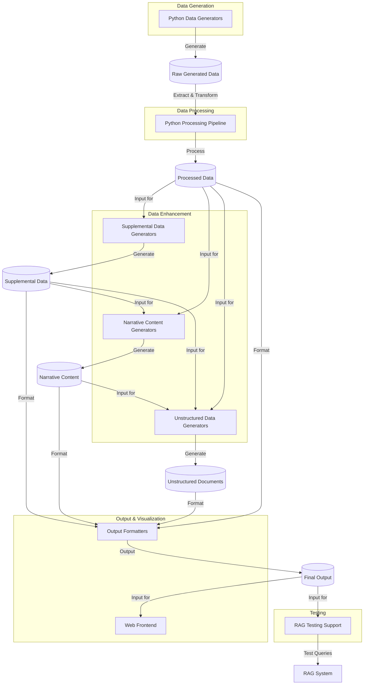
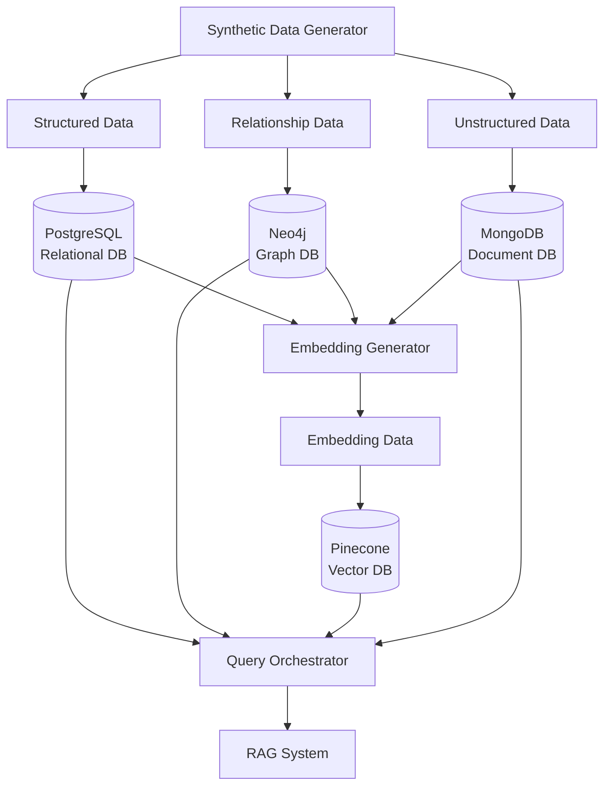
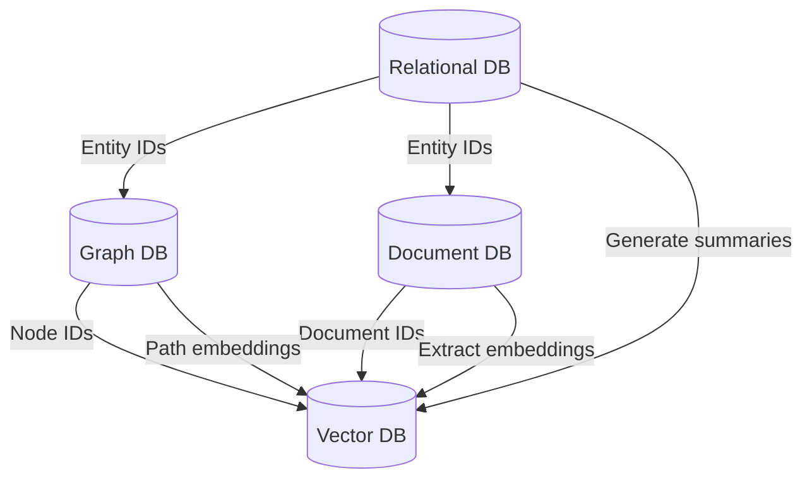
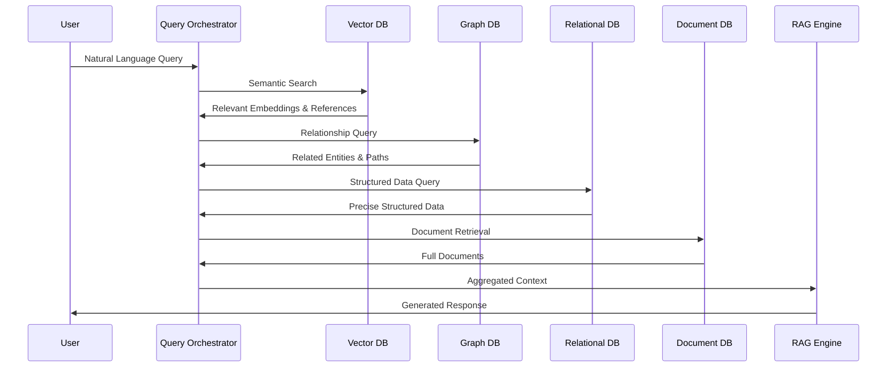
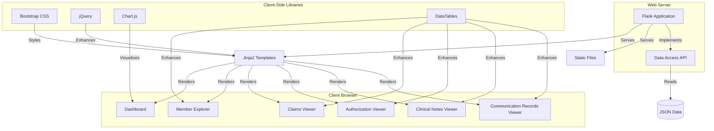
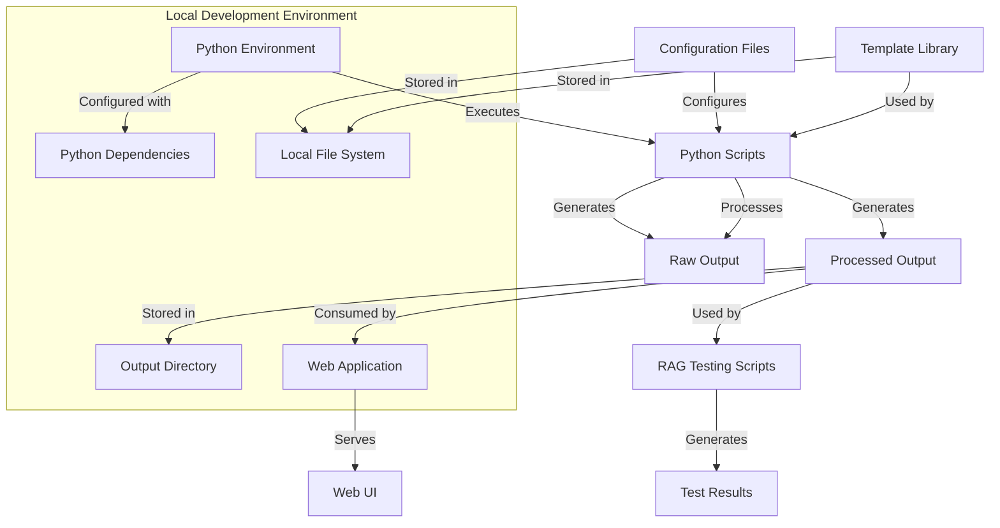

# Synthetic Healthcare Data Generator - Architecture

This document provides a comprehensive view of the solution architecture for our synthetic healthcare data generator, including system components, data flows, database design, and implementation considerations.

2025-03-19 11:38:00 - Created consolidated architecture document.
2025-03-19 16:39:00 - Updated to include web frontend architecture.
2025-03-20 13:40:00 - Updated to reflect integrated data ecosystem approach rather than separating components by phase.

## System Architecture Overview

## Key System Components

### 1. Core Data Generation
- Member Generator: Creates member demographics, contact info, and insurance details
- Provider Generator: Creates healthcare providers with specialties and locations
- Encounter Generator: Creates healthcare encounters with dates, types, and providers
- Condition Generator: Creates medical conditions with onset dates and status
- Medication Generator: Creates medication records with dosages and dates
- Procedure Generator: Creates medical procedures with dates and providers

### 2. Insurance Data Generation
- Claims Generator: Creates insurance claims based on clinical events
- Prior Auth Generator: Generates authorization requests and decisions
- EOB Generator: Creates explanation of benefits documents
- Plan Coverage Generator: Defines insurance plan details and coverage rules
- Formulary Generator: Creates medication formularies with tiers and rules
- Pharmacy Claims Generator: Creates pharmacy-specific claims

### 3. Care Management Data Generation
- Care Episode Generator: Creates sequences of related healthcare events
- SDOH Assessment Generator: Creates social determinants of health assessments
- Risk Assessment Generator: Creates comprehensive risk assessments
- Care Plan Generator: Creates structured and narrative care plans
- Provider Network Generator: Creates provider networks and relationships
- Authorization Rules Generator: Creates rules for determining authorization requirements

### 4. Narrative Content Generation
- Clinical Notes Generator: Creates realistic clinical documentation
- Communication Records Generator: Produces provider-patient communications
- Auth Rationale Generator: Produces detailed authorization decision rationales
- Patient-Generated Data: Creates health journals, symptom reports, etc.
- Provider Communications: Generates referral letters, consult notes, etc.
- Insurance Communications: Produces coverage letters, appeal responses, etc.

### 5. Specialized Document Generation
- Mental Health Narratives: Creates therapy notes and assessments
- Telehealth Documentation: Generates virtual visit documentation
- Education Materials: Creates condition-specific educational content
- Device Data Reports: Generates narrative reports from medical devices
- Social Service Documentation: Creates social needs assessments and referrals

### 6. Data Processing and Output
- Python Processing Pipeline: Extracts and transforms generated data
- Data Validation: Ensures consistency across all data types
- JSON Formatter: Structures data in JSON format
- Graph Formatter: Prepares data for graph database import
- Document Formatter: Formats unstructured content with appropriate metadata

### 7. Web Frontend
- Dashboard: Provides summary statistics and visualizations
- Member Explorer: Displays detailed member information and relationships
- Claims Viewer: Shows claims data with filtering and sorting
- Authorization Explorer: Displays prior authorization details and status
- Clinical Notes Viewer: Renders clinical documentation with formatting
- Communication Records Explorer: Shows provider-patient communications
- Care Episode Viewer: Shows sequences of related healthcare events
- SDOH Assessment Viewer: Shows social determinants of health assessments
- Risk Assessment Viewer: Shows comprehensive risk assessments
- Provider Network Viewer: Shows provider networks and relationships
- Pharmacy Benefit Viewer: Shows formularies and pharmacy claims
- Authorization Rules Viewer: Shows authorization rules and decisions
- Data Visualization Components: Charts and graphs for data analysis
- Interactive Data Tables: Sortable and filterable data tables
- Search Functionality: Allows searching across all data types

### 8. RAG Testing Support
- Embeddings Generator: Creates vector embeddings for semantic search
- Query Templates: Provides realistic natural language query examples
- Ground Truth Generator: Creates expected answers for test queries
- Evaluation Framework: Measures RAG system performance
- Evaluation Framework: Measures RAG system performance

## Data Flow Architecture

```mermaid
flowchart TD
    %% Data Sources
    PythonGenerators[Python Data Generators]
    
    %% Domain Data
    MemberData[Member Data]
    ProviderData[Provider Data]
    EncounterData[Encounter Data]
    ConditionData[Condition Data]
    MedicationData[Medication Data]
    ProcedureData[Procedure Data]
    
    %% Supplemental Data
    ClaimsData[Claims Data]
    PriorAuthData[Prior Auth Data]
    EOBData[EOB Data]
    PlanCoverageData[Plan Coverage Data]
    
    %% Narrative Content
    ClinicalNotes[Clinical Notes]
    CommunicationRecords[Communication Records]
    CarePlans[Care Plans]
    AuthRationales[Auth Rationales]
    
    %% Unstructured Documents
    PatientGenerated[Patient-Generated Data]
    ProviderComms[Provider Communications]
    InsuranceComms[Insurance Communications]
    MentalHealth[Mental Health Narratives]
    Telehealth[Telehealth Documentation]
    EducationMaterials[Education Materials]
    DeviceData[Device Data Reports]
    SocialService[Social Service Documentation]
    
    %% Output Formats
    JSONOutput[JSON Output]
    GraphOutput[Graph Output]
    DocumentOutput[Document Output]
    
    %% RAG Components
    Embeddings[Embeddings]
    Queries[Test Queries]
    Answers[Ground Truth Answers]
    
    %% Flow
    PythonGenerators --> MemberData & ProviderData & EncounterData & ConditionData & MedicationData & ProcedureData
    
    MemberData & ProviderData & EncounterData --> ClaimsData
    MemberData & ProviderData & ConditionData & ProcedureData --> PriorAuthData
    ClaimsData --> EOBData
    MemberData --> PlanCoverageData
    
    MemberData & EncounterData & ConditionData & MedicationData & ProcedureData --> ClinicalNotes
    MemberData & ProviderData --> CommunicationRecords
    MemberData & ConditionData & MedicationData --> CarePlans
    PriorAuthData --> AuthRationales
    
    MemberData & ConditionData --> PatientGenerated
    ProviderData & EncounterData & ConditionData --> ProviderComms
    PlanCoverageData & ClaimsData & PriorAuthData & EOBData --> InsuranceComms
    MemberData & ConditionData --> MentalHealth
    MemberData & ProviderData & EncounterData --> Telehealth
    MemberData & ConditionData & MedicationData --> EducationMaterials
    MemberData & ConditionData --> DeviceData
    MemberData --> SocialService
    
    MemberData & ProviderData & EncounterData & ConditionData & MedicationData & ProcedureData & ClaimsData & PriorAuthData & EOBData & PlanCoverageData --> JSONOutput
    MemberData & ProviderData & EncounterData & ConditionData & MedicationData & ProcedureData & ClaimsData & PriorAuthData & EOBData & PlanCoverageData --> GraphOutput
    ClinicalNotes & CommunicationRecords & CarePlans & AuthRationales & PatientGenerated & ProviderComms & InsuranceComms & MentalHealth & Telehealth & EducationMaterials & DeviceData & SocialService --> DocumentOutput
    
    JSONOutput & GraphOutput & DocumentOutput --> Embeddings
    JSONOutput & GraphOutput & DocumentOutput --> Queries
    JSONOutput & GraphOutput & DocumentOutput --> Answers
```

## Database Architecture

### Multi-Database Strategy

### Database Types and Data Allocation

#### 1. Relational Database (PostgreSQL)
- **Purpose**: Store structured data with well-defined relationships
- **Data Types**:
  - Core structured data (members, providers, encounters, conditions, medications, procedures)
  - Supplemental insurance data (claims, prior authorizations, EOBs, plan coverage)
  - Enhanced entities (care episodes, SDOH assessments, risk assessments)

#### 2. Graph Database (Neo4j)
- **Purpose**: Store and query relationship-rich data
- **Data Types**:
  - Entity relationships (member-provider, provider-provider, condition-medication)
  - Care pathways and journeys
  - Social determinants networks
  - Knowledge graph elements
  - Clinical decision trees
  - Provider collaboration networks

#### 3. Vector Database (Pinecone)
- **Purpose**: Store and query vector embeddings for semantic search
- **Data Types**:
  - Embeddings of narrative content
  - Embeddings of unstructured documents
  - Embeddings of structured data summaries
  - Multi-modal embeddings

#### 4. Document Database (MongoDB)
- **Purpose**: Store semi-structured document data
- **Data Types**:
  - Complete document records (clinical notes, communications, care plans)
  - Semi-structured data (device reports, telehealth records)
  - Hierarchical data (nested medical records, encounter bundles)

### Cross-Database Integration

## Query Flow for RAG

## Web Frontend Architecture

### Web Frontend Components

#### 1. Server-Side Components
- **Flask Application**: Python web framework for serving the application
- **Jinja2 Templates**: HTML templates with dynamic content rendering
- **Data Access API**: Backend services for retrieving and processing data
- **Route Handlers**: Controllers for different application views

#### 2. Client-Side Components
- **Bootstrap**: Responsive CSS framework for layout and UI components
- **jQuery**: JavaScript library for DOM manipulation and AJAX requests
- **Chart.js**: JavaScript charting library for data visualizations
- **DataTables**: Interactive table plugin with sorting, filtering, and pagination
- **Custom JavaScript**: Application-specific functionality and interactivity

#### 3. Key Views
- **Dashboard**: Summary statistics, key metrics, and visualizations
- **Member Explorer**: Detailed member information with related entities
- **Claims Viewer**: Claims data with service lines and financial details
- **Authorization Viewer**: Prior authorization details with status tracking
- **Clinical Notes Viewer**: Formatted clinical documentation with search
- **Communication Records Viewer**: Provider-patient communications

#### 4. Data Flow
- JSON data files are loaded by the Flask application
- Data is processed and transformed for presentation
- Templates are rendered with the processed data
- Client-side JavaScript enhances the user experience
- Visualizations are generated from the data
- Interactive tables allow exploration of detailed data

## Deployment Architecture

## Implementation Considerations

### 1. Integrated Data Ecosystem
- Organize code by healthcare domain rather than by implementation phase
- Use consistent naming conventions across all data types
- Implement unified data access patterns for all components
- Ensure seamless integration between different data domains
- Present a cohesive view of all data in the web interface

### 2. Data Synchronization
- Implement change data capture (CDC) to propagate updates across databases
- Maintain consistent entity IDs across all database systems
- Use event-driven architecture for real-time updates

### 3. Embedding Strategy
- Use domain-specific embedding models for healthcare content
- Create multiple embedding types for different query purposes
- Implement chunking strategies for long documents

### 4. Query Orchestration
- Develop a query router to determine optimal database path
- Implement query templates for common healthcare questions
- Create a result aggregator to combine multi-database results

### 5. Performance Optimization
- Implement caching for frequently accessed data
- Use database-specific indexing strategies
- Consider read replicas for high-query-volume scenarios

### 6. Database Sizing Estimates
- Relational Database: 5-10 GB for 10,000 members with 5 years of data
- Graph Database: 2-5 GB with ~5,000,000 relationships
- Vector Database: 10-20 GB with ~1,000,000 embeddings
- Document Database: 20-40 GB with ~1,100,000 documents

### 7. Web Frontend Considerations
- **Integrated View**: Present all data types in a cohesive, domain-organized interface
- **Scalability**: Implement pagination and lazy loading for large datasets
- **Performance**: Use caching for frequently accessed data and visualizations
- **Responsiveness**: Ensure proper rendering on various device sizes
- **Accessibility**: Follow WCAG guidelines for accessible web design
- **Security**: Implement proper input validation and output encoding
- **Future Enhancements**:
  - User authentication and authorization
  - Advanced search capabilities
  - Custom report generation
  - Data export functionality
  - Real-time data updates