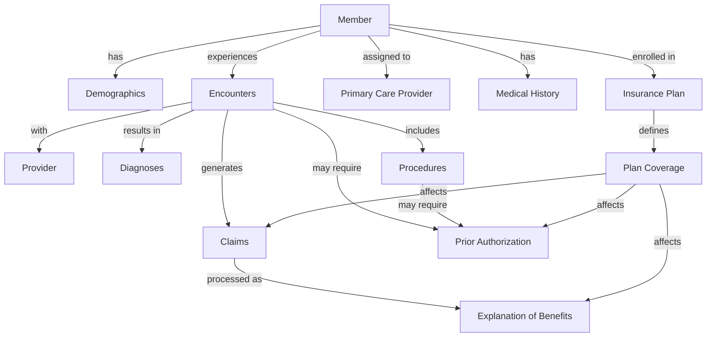
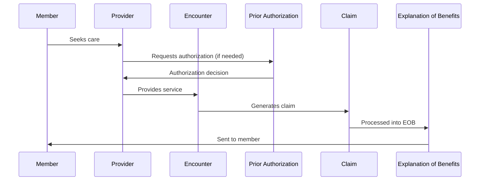
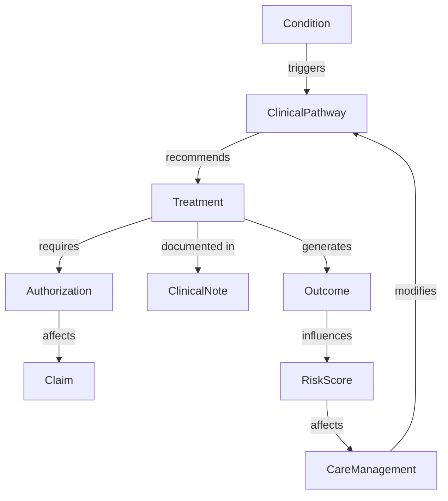
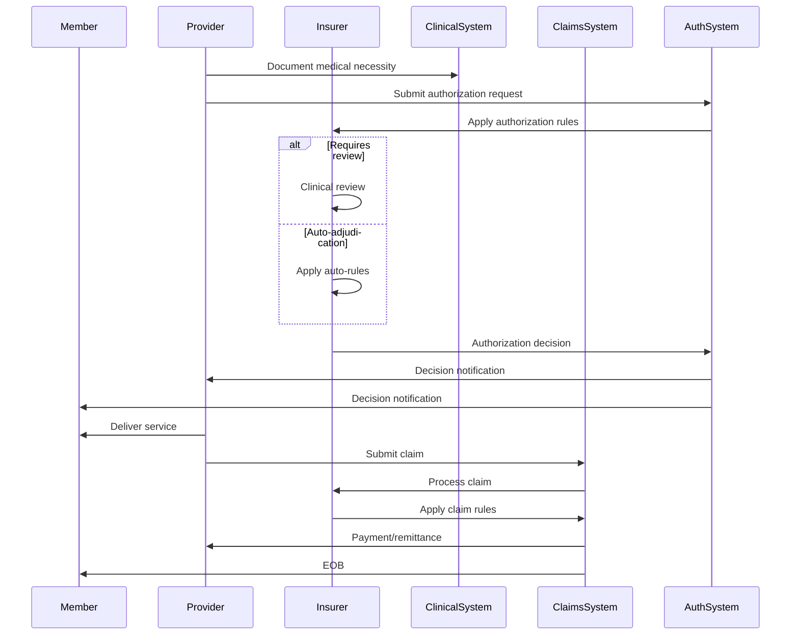
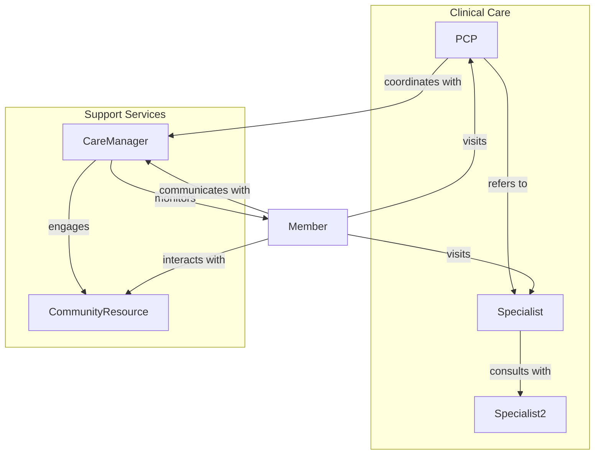
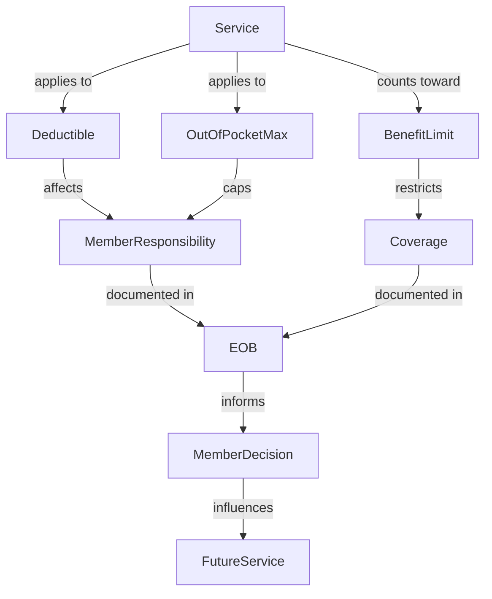

# Synthetic Healthcare Data Model

This document provides a comprehensive view of the data model for our synthetic healthcare data generator, including core entities, healthcare entities, relationships, and data consistency rules.

2025-03-19 11:39:00 - Created consolidated data model document.
2025-03-19 14:45:00 - Updated to reflect decision to use custom Python libraries instead of Synthea for healthcare data generation.
2025-03-20 13:40:00 - Updated to reflect integrated data ecosystem approach rather than separating "enhanced" data.

# Synthetic Healthcare Data Model

This document provides a comprehensive view of the data model for our synthetic healthcare data generator, including core entities, enhanced healthcare entities, relationships, and data consistency rules.

2025-03-19 11:39:00 - Created consolidated data model document.

## Core Entity Relationships

## Clinical to Insurance Data Flow

## Comprehensive Data Model Components

### 1. Member Profile

**Core Fields**:
- Demographics (age, gender, address)
- Insurance information (plan, member ID, group number)
- Primary care provider
- Basic health information

**Extended Fields**:
- **Socioeconomic Status**: Income level, education level, occupation
- **Digital Health Engagement**: Portal usage, app usage, communication preferences
- **Care Management Status**: Risk tier, care program enrollment, case manager assignment
- **Benefit Utilization**: Deductible status, out-of-pocket maximum status, benefit period utilization
- **Health Literacy Level**: Documented understanding of health concepts
- **Preferred Language for Healthcare**: May differ from primary language
- **Advanced Directive Status**: Presence and type of advance directives
- **Proxy/Caregiver Information**: For members with designated caregivers

**Rationale**: These fields provide important context for personalized healthcare interactions and are critical for realistic health advocacy scenarios.

### 2. Provider Network and Relationships

**Provider Network Entity**:
- Network ID and name
- Network type (narrow, broad, tiered)
- Geographic coverage
- Specialty coverage
- Effective dates

**Provider Relationship Entity**:
- Relationship type (PCP-specialist, specialist-specialist, etc.)
- Referral patterns
- Communication frequency
- Shared patients count
- Collaboration score

**Rationale**: Provider networks and relationships significantly impact care coordination and authorization processes in real-world healthcare.

### 3. Care Episodes

**Care Episode Entity**:
- Episode ID
- Episode type (acute, chronic, preventive)
- Triggering event/condition
- Start and end dates
- Related encounters
- Related claims
- Episode status
- Clinical outcome
- Financial outcome

**Rationale**: Care episodes represent a clinically meaningful sequence of related healthcare services, providing context that spans individual encounters.

### 4. Social Determinants of Health (SDOH)

**SDOH Assessment Entity**:
- Housing stability
- Food security
- Transportation access
- Social isolation/support
- Financial strain
- Employment stability
- Environmental exposures
- Safety concerns
- Assessment date
- Intervention referrals

**Rationale**: SDOH factors significantly impact healthcare outcomes and utilization patterns, and are increasingly incorporated into care management.

### 5. Health Risk Assessments

**Risk Assessment Entity**:
- Assessment type (general health, disease-specific, fall risk, etc.)
- Assessment date
- Risk scores (overall and domain-specific)
- Identified risk factors
- Recommended interventions
- Reassessment schedule

**Rationale**: Risk assessments drive many care management decisions and authorization requirements in healthcare.

### 6. Pharmacy Benefit Details

**Formulary Entity**:
- Formulary ID
- Tier structure
- Covered medications
- Prior authorization requirements
- Step therapy requirements
- Quantity limits
- Specialty pharmacy requirements

**Pharmacy Claim Entity**:
- Distinct from medical claims
- Pharmacy-specific fields (NDC codes, days supply, pharmacy ID)
- Medication adherence metrics

**Rationale**: Pharmacy benefits have unique structures and workflows that differ from medical benefits.

### 7. Authorization Rules Engine

**Authorization Rule Entity**:
- Service/procedure codes
- Required documentation
- Clinical criteria
- Approval pathways
- Denial reasons
- Appeal process
- Rule effective dates

**Rationale**: Authorization rules determine approval/denial decisions and are critical for realistic prior authorization scenarios.

## Enhanced Relationships and Flows

### 1. Clinical Decision Pathways

### 2. Authorization and Claims Flow

### 3. Care Coordination Network

### 4. Benefit Utilization Flow

## Comprehensive Data Model

```mermaid
erDiagram
    %% Core Entities
    MEMBER ||--o{ INSURANCE_PLAN : "enrolled in"
    MEMBER ||--o{ ENCOUNTER : "participates in"
    MEMBER ||--o{ CONDITION : "has"
    MEMBER ||--o{ MEDICATION : "takes"
    MEMBER ||--o{ ALLERGY : "has"
    MEMBER ||--o{ PROCEDURE : "undergoes"
    MEMBER ||--o{ CLAIM : "associated with"
    MEMBER ||--o{ PRIOR_AUTH : "requests"
    MEMBER ||--o{ EOB : "receives"
    
    %% Enhanced Member Profile
    MEMBER ||--|| SOCIOECONOMIC_STATUS : "has"
    MEMBER ||--|| DIGITAL_HEALTH_ENGAGEMENT : "has"
    MEMBER ||--|| CARE_MANAGEMENT_STATUS : "has"
    MEMBER ||--|| BENEFIT_UTILIZATION : "has"
    MEMBER ||--o{ PROXY_CAREGIVER : "may have"
    MEMBER ||--o{ ADVANCED_DIRECTIVE : "may have"
    
    %% Provider Relationships
    PROVIDER ||--o{ PROVIDER_NETWORK : "participates in"
    PROVIDER ||--o{ PROVIDER_RELATIONSHIP : "has"
    PROVIDER_RELATIONSHIP }|--|| PROVIDER : "with"
    
    %% Care Episodes
    MEMBER ||--o{ CARE_EPISODE : "experiences"
    CARE_EPISODE ||--o{ ENCOUNTER : "includes"
    CARE_EPISODE ||--o{ CLAIM : "includes"
    CARE_EPISODE ||--|| CONDITION : "addresses"
    
    %% SDOH
    MEMBER ||--o{ SDOH_ASSESSMENT : "receives"
    SDOH_ASSESSMENT ||--o{ SDOH_INTERVENTION : "recommends"
    SDOH_INTERVENTION }|--|| COMMUNITY_RESOURCE : "provided by"
    
    %% Risk Assessments
    MEMBER ||--o{ RISK_ASSESSMENT : "undergoes"
    RISK_ASSESSMENT ||--o{ RISK_FACTOR : "identifies"
    RISK_ASSESSMENT ||--o{ INTERVENTION : "recommends"
    
    %% Pharmacy Benefits
    INSURANCE_PLAN ||--|| FORMULARY : "includes"
    FORMULARY ||--o{ MEDICATION : "covers"
    MEMBER ||--o{ PHARMACY_CLAIM : "has"
    PHARMACY_CLAIM ||--|| MEDICATION : "for"
    
    %% Authorization Rules
    PRIOR_AUTH ||--|| AUTH_RULE : "evaluated against"
    AUTH_RULE ||--o{ DOCUMENTATION_REQUIREMENT : "includes"
    AUTH_RULE ||--o{ CLINICAL_CRITERIA : "includes"
    
    %% Care Coordination
    MEMBER ||--|| CARE_MANAGER : "assigned to"
    CARE_MANAGER ||--o{ CARE_PLAN : "manages"
    CARE_PLAN ||--o{ CARE_GOAL : "includes"
    CARE_PLAN ||--o{ INTERVENTION : "includes"
    
    %% Benefit Structure
    INSURANCE_PLAN ||--|| BENEFIT_STRUCTURE : "defines"
    BENEFIT_STRUCTURE ||--o{ BENEFIT_LIMIT : "includes"
    BENEFIT_STRUCTURE ||--|| DEDUCTIBLE : "includes"
    BENEFIT_STRUCTURE ||--|| OUT_OF_POCKET_MAX : "includes"
    
    %% Clinical Decision Support
    CONDITION ||--o{ CLINICAL_PATHWAY : "has"
    CLINICAL_PATHWAY ||--o{ TREATMENT_OPTION : "recommends"
    TREATMENT_OPTION ||--o{ PROCEDURE : "includes"
    TREATMENT_OPTION ||--o{ MEDICATION : "includes"
```

## Data Consistency Rules

### 1. Temporal Consistency

- **Rule**: All related events must maintain logical temporal order
  - Authorization before service
  - Service before claim
  - Claim before payment
  - Referral before specialist visit

### 2. Clinical Consistency

- **Rule**: Diagnoses, procedures, and medications must be clinically coherent
  - Medications appropriate for diagnoses
  - Procedures appropriate for diagnoses
  - Lab results consistent with conditions
  - Treatment progression follows clinical guidelines

### 3. Financial Consistency

- **Rule**: Financial amounts must reconcile across the system
  - Claim lines sum to claim total
  - Member responsibility + plan paid = allowed amount
  - Accumulator updates reflect service costs

### 4. Demographic Consistency

- **Rule**: Member demographics must be realistic and consistent
  - Age-appropriate conditions
  - Gender-appropriate services
  - Geographically appropriate providers
  - Socioeconomically consistent utilization patterns

## Implementation Considerations

### 1. Data Generation Parameters

- **Population Health Profile**: Configure disease prevalence, demographic distribution
- **Utilization Patterns**: Configure service utilization rates by population segment
- **Network Adequacy**: Configure provider availability by specialty and region
- **Benefit Design**: Configure plan designs to reflect market norms
- **Authorization Rules**: Configure authorization requirements by service type

### 2. Realistic Variation

- **Practice Pattern Variation**: Different providers should show different practice patterns
- **Regional Variation**: Utilization and cost should vary by region
- **Temporal Variation**: Seasonal patterns in certain conditions
- **Plan Variation**: Different coverage rules and network designs

### 3. Edge Cases

- **Rare Conditions**: Include some rare conditions and complex cases
- **Coverage Exceptions**: Include cases with non-standard coverage decisions
- **Complex Coordination**: Include cases requiring multiple specialists and care coordination
- **Appeals and Grievances**: Include cases with denied claims and appeals