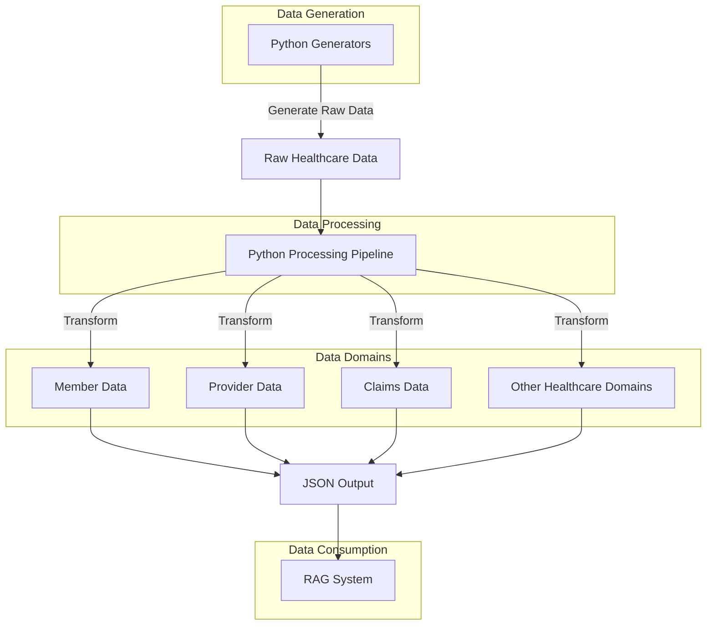

# Synthetic Healthcare Data Generator - Implementation Strategy

This document outlines the implementation strategy for our synthetic healthcare data generator, including system components, implementation phases, project structure, and technical requirements.

2025-03-19 11:40:00 - Created consolidated implementation strategy document.


## Implementation Overview



## System Components

### 1. Python Data Generators
- **Purpose**: Generate realistic synthetic healthcare data
- **Components**:
  - Core data generation modules
  - Configuration system
  - Batch generation scripts

### 2. Python Processing Pipeline
- **Purpose**: Process, transform, and customize generated data
- **Components**:
  - Data extraction and organization
  - Data transformation and enrichment
  - Domain-specific processors
  - Output formatting

### 3. Domain-Specific Processors
- **Purpose**: Extract and process domain-specific data
- **Components**:
  - Member data processor
  - Provider data processor
  - Claims data processor
  - Other domain processors (future)

### 4. Supplemental Data Generation
- **Purpose**: Generate insurance-related data
- **Components**:
  - Claims generator
  - Prior authorization generator
  - Explanation of benefits (EOB) generator
  - Plan coverage details generator
  - Data consistency validators

### 5. Narrative Content Generation
- **Purpose**: Generate realistic narrative text content for RAG testing
- **Components**:
  - Clinical notes generator
  - Communication records generator
  - Care plan generator
  - Authorization rationale generator
  - Member preference generator

### 6. Unstructured Data Generation
- **Purpose**: Generate diverse unstructured data types for comprehensive RAG testing
- **Components**:
  - Patient-generated health data generator
  - Provider-to-provider communications generator
  - Insurance communications generator
  - Mental health narratives generator
  - Telehealth documentation generator
  - Health education materials generator
  - Medical device data generator
  - Social service coordination generator

### 7. Database Integration
- **Purpose**: Store and query generated data in appropriate database systems
- **Components**:
  - Relational database connector (PostgreSQL)
  - Graph database connector (Neo4j)
  - Vector database connector (Pinecone)
  - Document database connector (MongoDB)
  - Cross-database synchronization
  - Query orchestration

### 8. Enhanced Data Model Implementation
- **Purpose**: Implement additional healthcare entities and relationships for more realistic data
- **Components**:
  - Care episodes generator
  - SDOH assessment generator
  - Risk assessment generator
  - Provider network and relationship generator
  - Pharmacy benefit and claims generator
  - Authorization rules engine
  - Data consistency validators

## Implementation Phases

### Phase 1: Setup and Initial Data Generation
1. Set up Python environment and dependencies
2. Develop initial data generation modules
3. Generate a small test dataset (100 patients)
4. Design Python processing pipeline architecture

### Phase 2: Core Data Processing
1. Develop member data generation modules
2. Transform and enrich member data
3. Implement JSON output for member data
4. Validate member data quality and completeness

### Phase 3: Insurance Data Generation
1. Develop claims data generator based on generated encounters
2. Implement prior authorization workflow and data generation
3. Create explanation of benefits (EOB) generator
4. Build plan coverage details generator
5. Ensure proper relationships with clinical data

### Phase 4: Narrative Content Enhancement
1. Develop clinical notes generator
2. Implement communication records generator
3. Create care plan and goals generator
4. Build authorization decision rationale generator
5. Add social determinants of health data
6. Generate member preferences and satisfaction data

### Phase 5: Web Frontend
1. Create Flask-based web application for data visualization and exploration
2. Implement interactive dashboard with summary statistics
3. Develop member data explorer with detailed views
4. Create views for claims, authorizations, and other insurance data
5. Implement clinical notes and care plans viewer
6. Develop communication records explorer
7. Add data visualization components
8. Create interactive data tables
9. Design responsive UI with Bootstrap

### Phase 6: Expanded Unstructured Data
1. Implement patient-generated health data generator
2. Develop provider-to-provider communications generator
3. Create insurance communications generator
4. Build mental health narratives generator
5. Implement telehealth documentation generator
6. Add remaining unstructured data generators as needed

### Phase 7: Enhanced Data Model
1. Implement care episodes generator
2. Develop SDOH assessment generator
3. Create risk assessment generator
4. Build provider network and relationship generator
5. Implement pharmacy benefit and claims generator
6. Develop authorization rules engine
7. Create comprehensive data consistency validators

### Phase 8: Database Integration
1. Set up and configure database systems
2. Implement data loading pipelines for each database
3. Create cross-database references and synchronization
4. Develop query orchestration layer
5. Implement caching and performance optimizations

### Phase 9: RAG Testing Support
1. Implement embeddings generation for key data elements
2. Create graph representation of the data
3. Develop natural language query templates
4. Generate ground truth answers for test queries
5. Create evaluation framework for RAG performance

### Phase 10: Scaling and Optimization
1. Generate larger dataset (10,000 patients)
2. Optimize processing pipeline for performance
3. Implement data validation and consistency checks
4. Create documentation for the system

## Project Structure

```
synthetic-healthcare-data/
├── README.md
├── setup.py
├── requirements.txt
├── src/
│   ├── processors/           # Data processors
│   │   ├── __init__.py
│   │   ├── base_processor.py
│   │   ├── member_processor.py
│   │   ├── provider_processor.py
│   │   ├── claims_processor.py
│   │   ├── prior_auth_processor.py
│   │   ├── eob_processor.py
│   │   └── plan_coverage_processor.py
│   ├── generators/           # Supplemental data generators
│   │   ├── __init__.py
│   │   ├── base_generator.py
│   │   ├── claims_generator.py
│   │   ├── prior_auth_generator.py
│   │   ├── eob_generator.py
│   │   └── plan_coverage_generator.py
│   ├── narrative/             # Narrative content generators
│   │   ├── __init__.py
│   │   ├── clinical_notes.py
│   │   ├── communication.py
│   │   ├── care_plans.py
│   │   ├── auth_rationales.py
│   │   └── member_preferences.py
│   ├── unstructured/          # Unstructured data generators
│   │   ├── __init__.py
│   │   ├── patient_generated.py
│   │   ├── provider_communications.py
│   │   ├── insurance_communications.py
│   │   ├── mental_health.py
│   │   ├── telehealth.py
│   │   ├── education_materials.py
│   │   ├── device_data.py
│   │   └── social_services.py
│   ├── databases/             # Database connectors
│   │   ├── __init__.py
│   │   ├── relational.py
│   │   ├── graph.py
│   │   ├── vector.py
│   │   ├── document.py
│   │   ├── sync.py
│   │   └── query.py
│   ├── enhanced/              # Enhanced data model generators
│   │   ├── __init__.py
│   │   ├── care_episodes.py
│   │   ├── sdoh.py
│   │   ├── risk_assessment.py
│   │   ├── provider_network.py
│   │   ├── pharmacy.py
│   │   ├── auth_rules.py
│   │   └── consistency.py
│   ├── rag_support/           # RAG testing support
│   │   ├── __init__.py
│   │   ├── embeddings.py
│   │   ├── graph_export.py
│   │   ├── query_templates.py
│   │   └── ground_truth.py
│   ├── models/               # Data models
│   │   ├── __init__.py
│   │   ├── member.py
│   │   ├── provider.py
│   │   └── claim.py
│   ├── utils/                # Utility functions
│   │   ├── __init__.py
│   │   ├── file_utils.py
│   │   └── validation_utils.py
│   └── main.py               # Main entry point
├── config/                   # Configuration files
│   └── config.json           # Main configuration
├── tests/                    # Test files
│   ├── __init__.py
│   ├── test_processors.py
│   └── test_models.py
└── output/                   # Generated data output
    ├── raw/                  # Raw generated data
    └── processed/            # Processed data for RAG
```

## Technical Requirements

### 1. Development Environment
- Modern development environment for Python

### 2. Python Environment
- Python 3.8+ for data processing
- Required libraries:
  - pandas for data manipulation
  - numpy for numerical operations
  - json for JSON handling
  - pytest for testing

### 3. Database Requirements
- PostgreSQL 13+ for relational data
- Neo4j 4.4+ for graph data
- Pinecone or similar for vector embeddings
- MongoDB 5.0+ for document storage

### 4. Storage
- Local file system for storing generated data
- Minimum 5GB for raw and processed data
- 50-100GB for database storage (all databases combined)

### 5. Performance Considerations
- Batch processing for large datasets
- Memory-efficient processing for 10,000+ patients
- Parallel processing for data generation and transformation
- Optimized database queries for RAG testing

### 6. Development Tools
- Git for version control
- Docker for containerization (optional)
- Jupyter notebooks for data exploration and testing